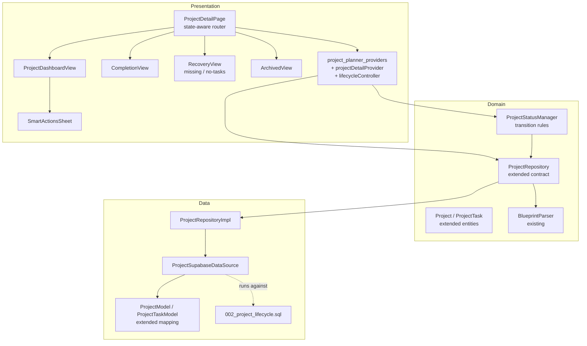
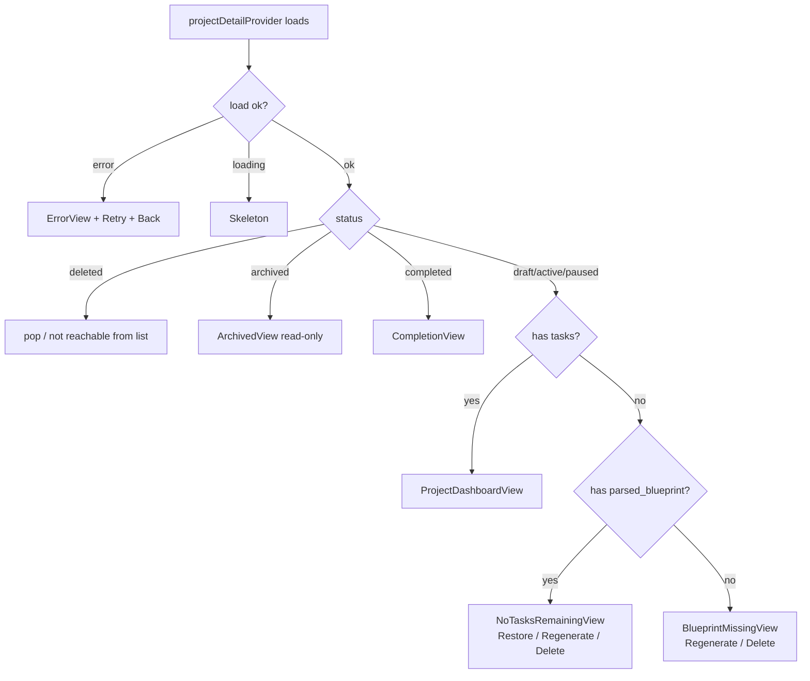
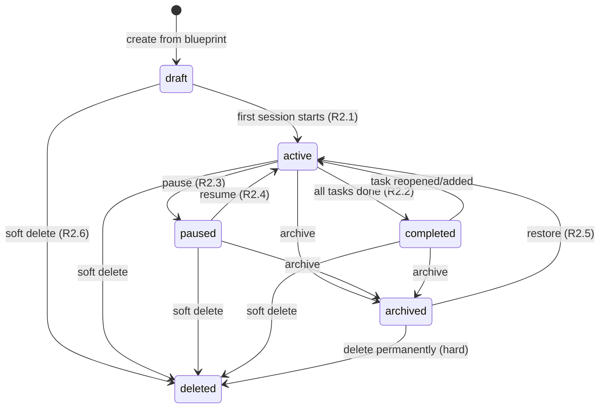

# Design Document

## Overview

This design turns the Blueprint → Project feature into a full lifecycle system. It extends the existing Clean Architecture (`domain` → `data` → `presentation`) in `lib/features/project_planner/` rather than replacing it, adds the lifecycle fields to the domain entities and Supabase schema, introduces a `ProjectStatusManager` for transition rules and progress recomputation, replaces the dead-end Project Detail screen with a state-aware router, and adds a recovery path that rebuilds tasks from the stored `parsed_blueprint` JSON.

The guiding constraints (from requirements):
- Android-first, premium/deliberate UI; every state has at least one forward action; no generic empty states.
- Idempotent, backward-compatible SQL migration; existing `active` rows keep working.
- Real Postgres errors surface through the repository; nothing is swallowed.
- All UI reads `Theme.of(context).colorScheme` / `textTheme` so it works across the 10 installed themes, and is wrapped in `ResponsiveCenter` + `SafeArea`.

### Goals

- Six-status lifecycle with automatic transitions driven by activity.
- A rich Project Dashboard, a Completion Experience, and recovery states — all behind one screen entry point.
- Schema additions + safe migration script.
- Keep blast radius contained: reuse `BlueprintParser.blueprintToTasks`, `ProjectHealth`, `projectsProvider`, and the existing datasource patterns.

### Non-goals

- No changes to the wizard's prompt generation or the manual "paste AI response" mechanism (Regenerate routes back into the existing wizard).
- No live AI model call; "AI Reflection" is a local template over real data.
- No background job for the 30-day purge in this spec (documented as a DB/maintenance concern; client only excludes `is_deleted`).

## Architecture

### Current → Target module map



### Layering rules

- **Domain** owns the `ProjectStatus`/`ProjectTaskStatus` enums, the extended `Project`/`ProjectTask` entities, the `ProjectStatusManager` (pure transition logic, no I/O), and the `ProjectRepository` contract.
- **Data** owns SQL, model mapping (`fromJson`/`toInsertJson`), and the Supabase datasource. It is the only layer that knows column names.
- **Presentation** owns the state-aware screen, the Riverpod `projectDetailProvider`, and a `ProjectLifecycleController` that calls repository + status-manager and refreshes providers.

## State-aware screen routing

The Project Detail screen becomes a pure router over a computed `ProjectDetailViewState`. This is the central fix for the dead-end.



### View-state resolver (pure function)

```dart
enum ProjectDetailViewKind {
  loading, error, archived, completed,
  dashboard, noTasksRemaining, blueprintMissing,
}

ProjectDetailViewKind resolveViewKind({
  required ProjectStatus status,
  required bool hasTasks,
  required bool hasParsedBlueprint,
}) {
  if (status == ProjectStatus.completed) return ProjectDetailViewKind.completed;
  if (status == ProjectStatus.archived) return ProjectDetailViewKind.archived;
  if (hasTasks) return ProjectDetailViewKind.dashboard;
  return hasParsedBlueprint
      ? ProjectDetailViewKind.noTasksRemaining
      : ProjectDetailViewKind.blueprintMissing;
}
```

Maps to: R3.1 (no generic empty), R3.2 (missing), R3.3 (completed), R3.4 (no-tasks-remaining), R3.5 (always a forward action), R10.3 (error state has forward action).

## Status state machine

`ProjectStatusManager` is pure domain logic. It validates a requested transition against the current status and returns either the field mutations to persist or a typed rejection.



### Transition contract

```dart
sealed class TransitionResult {}
class TransitionAllowed extends TransitionResult {
  final Map<String, dynamic> fieldUpdates; // column → value for projects row
}
class TransitionRejected extends TransitionResult {
  final String reason; // surfaced to UI, never silent (R2.7)
}

class ProjectStatusManager {
  TransitionResult start(Project p);       // draft → active, sets started_at, last_active_at
  TransitionResult pause(Project p);       // active → paused, sets paused_at
  TransitionResult resume(Project p);      // paused → active, clears paused_at
  TransitionResult complete(Project p);    // active → completed, sets completed_at
  TransitionResult reopen(Project p);      // completed → active
  TransitionResult archive(Project p);     // active/paused/completed → archived, sets archived_at
  TransitionResult restore(Project p);     // archived → active, clears archived_at
  TransitionResult softDelete(Project p);  // → deleted, is_deleted=true, deleted_at
}
```

Every allowed transition includes `last_active_at = now` (R2.8). Undefined transitions return `TransitionRejected` without mutating (R2.7).

## Components and Interfaces

### Domain entity changes

`ProjectStatus` enum extends to six values; `fromJson` must NOT coerce unknown → active blindly for the new values, but keeps `active` as the fallback for genuinely unrecognized strings (backward compatibility, R9).

```dart
enum ProjectStatus {
  draft, active, paused, completed, archived, deleted;

  String get jsonKey => /* snake matching DB */;
  static ProjectStatus fromJson(String? v) => switch (v) {
    'draft' => draft, 'paused' => paused, 'completed' => completed,
    'archived' => archived, 'deleted' => deleted, 'active' => active,
    _ => active, // unknown legacy → active (R1.5 / R9.6)
  };
}
```

`Project` gains (all nullable or defaulted so old rows map cleanly — R1.7):

| Field | Type | Notes |
|---|---|---|
| startedAt | DateTime? | null until first session |
| completedAt | DateTime? | |
| pausedAt | DateTime? | |
| archivedAt | DateTime? | |
| deletedAt | DateTime? | |
| lastActiveAt | DateTime? | |
| completionPercentage | int | default 0 |
| completedDays | int | default 0 |
| completedTasks | int | default 0 |
| estimatedTotalMinutes | int | default 0 |
| actualMinutesSpent | int | default 0 |
| streakDays | int | default 0 |
| isDeleted | bool | default false |

`Project` also gains computed getters (no storage): `effectiveStartDate => startedAt ?? createdAt`, `currentDayNumber` (clamped `[1, durationDays]`), `remainingDays`.

`ProjectTask` gains `isCompleted` (kept in sync with `status == completed`), `actualMinutes` (default 0). `completedAt` and `sortOrder` already exist.

### Repository contract additions

```dart
abstract class ProjectRepository {
  // existing: fetchProjects, fetchProject, createProject, updateProjectStatus,
  //           deleteProject, fetchProjectTasks, insertProjectTasks,
  //           updateTaskStatus, deleteTask

  // NEW
  Future<List<Project>> fetchProjects({bool includeDeleted = false}); // R7.5
  Future<void> applyTransition(String projectId, Map<String, dynamic> fieldUpdates); // status + timestamps
  Future<void> updateProjectProgress(String projectId, ProjectProgress progress);    // R8
  Future<Project> duplicateProject(String sourceProjectId);  // R5.4 / R7 duplicate
  Future<void> hardDeleteProject(String projectId);          // archived → delete permanently (R7.4)
  Future<void> restoreTasksFromBlueprint(String projectId);  // R6 recovery
  Future<void> replaceProjectTasks(String projectId, List<ProjectTask> tasks); // recovery atomic-ish
}
```

`fetchProjects` default filters `is_deleted = false` (R7.5, R8 list integration). `deleteProject` is repurposed to the soft-delete path via `applyTransition`; a separate `hardDeleteProject` handles archived permanent delete.

### ProjectProgress value object (R8)

```dart
class ProjectProgress {
  final int completionPercentage; // 0..100
  final int completedTasks;
  final int completedDays;
  final int actualMinutesSpent;
  final int streakDays;
  final DateTime lastActiveAt;
}
```

Computed by a pure `ProgressCalculator.fromTasks(List<ProjectTask> tasks, {DateTime? previousActiveDay})`:
- `completionPercentage = round(completed / total * 100)` clamped 0–100 (R8.2).
- `completedDays` = count of distinct `dayNumber` where every task in that day is completed.
- `streakDays` = consecutive calendar days (by `completedAt`) with ≥1 completion; resets to 0 on a gap (R8.4, R8.5).
- `actualMinutesSpent` = Σ task.actualMinutes.

### Lifecycle controller (presentation)

A Riverpod `Notifier` that orchestrates: call `ProjectStatusManager` → persist via repository → recompute progress → invalidate `projectDetailProvider(id)` and `projectsProvider`. Each method returns a `Result` so the UI can show the real error (R10.2/10.3).

```dart
class ProjectLifecycleController extends FamilyNotifier<AsyncValue<void>, String> {
  Future<void> start();      Future<void> pause();   Future<void> resume();
  Future<void> archive();    Future<void> restore(); Future<void> softDelete();
  Future<void> deletePermanently();
  Future<void> duplicate();        // returns new id via state/event
  Future<void> restoreBlueprint(); // R6
  Future<void> completeIfAllDone();// invoked after task toggle (R2.2)
  Future<void> toggleTask(String taskId, ProjectTaskStatus next); // updates task + progress + maybe complete/reopen
}
```

## Recovery system (R6)

```mermaid
flowchart TD
    A[Restore Blueprint tapped] --> B{parsed_blueprint exists?}
    B -- no --> R[reject → BlueprintMissingView]
    B -- yes --> C[parser.blueprintToTasks(projectId, parsed)]
    C --> D[repository.replaceProjectTasks in one call]
    D -- ok --> E[recompute progress + invalidate provider]
    D -- error --> F[surface Postgres error, tasks unchanged]
```

- Reuses the existing `BlueprintParser.blueprintToTasks` and `ProjectModel._parseBlueprintFromJson` — no new parsing logic.
- `replaceProjectTasks` deletes existing rows for the project then inserts the rebuilt set, so there are no duplicates (R6 dedup intent). Because Supabase has no client transaction, the datasource performs delete-then-insert and, on insert failure after a delete, surfaces the error; to satisfy R6.6 ("leave existing tasks unchanged"), recovery only runs when task count is 0 (the no-tasks states), so there is nothing to lose. For the general "Regenerate tasks" we still replace, but the precondition (0 tasks) makes it safe.
- Reconstructed tasks are `pending` (R6.3).

## Data Models

This section defines the entities, value objects, and SQL schema for the lifecycle.

### Migration script `002_project_lifecycle.sql` (idempotent — R9.4)

Order matters: widen the CHECK constraint **before** any new-status write (risk noted in requirements).

```sql
-- 1. PROJECTS: add columns (idempotent)
ALTER TABLE projects ADD COLUMN IF NOT EXISTS started_at timestamptz;
ALTER TABLE projects ADD COLUMN IF NOT EXISTS completed_at timestamptz;
ALTER TABLE projects ADD COLUMN IF NOT EXISTS paused_at timestamptz;
ALTER TABLE projects ADD COLUMN IF NOT EXISTS archived_at timestamptz;
ALTER TABLE projects ADD COLUMN IF NOT EXISTS completion_percentage integer NOT NULL DEFAULT 0;
ALTER TABLE projects ADD COLUMN IF NOT EXISTS completed_days integer NOT NULL DEFAULT 0;
ALTER TABLE projects ADD COLUMN IF NOT EXISTS completed_tasks integer NOT NULL DEFAULT 0;
ALTER TABLE projects ADD COLUMN IF NOT EXISTS estimated_total_minutes integer NOT NULL DEFAULT 0;
ALTER TABLE projects ADD COLUMN IF NOT EXISTS actual_minutes_spent integer NOT NULL DEFAULT 0;
ALTER TABLE projects ADD COLUMN IF NOT EXISTS streak_days integer NOT NULL DEFAULT 0;
ALTER TABLE projects ADD COLUMN IF NOT EXISTS last_active_at timestamptz;
ALTER TABLE projects ADD COLUMN IF NOT EXISTS is_deleted boolean NOT NULL DEFAULT false;
ALTER TABLE projects ADD COLUMN IF NOT EXISTS deleted_at timestamptz;

-- 2. PROJECTS: widen status CHECK (drop old, add new) — before default change
ALTER TABLE projects DROP CONSTRAINT IF EXISTS projects_status_check;
ALTER TABLE projects ADD CONSTRAINT projects_status_check
  CHECK (status IN ('draft','active','paused','completed','archived','deleted'));

-- 3. PROJECTS: change default for new rows only (existing rows untouched — R9.5/9.7)
ALTER TABLE projects ALTER COLUMN status SET DEFAULT 'draft';

-- 4. PROJECT_TASKS: add columns
ALTER TABLE project_tasks ADD COLUMN IF NOT EXISTS is_completed boolean NOT NULL DEFAULT false;
ALTER TABLE project_tasks ADD COLUMN IF NOT EXISTS actual_minutes integer NOT NULL DEFAULT 0;
-- completed_at and sort_order already exist in 001; guarded for safety:
ALTER TABLE project_tasks ADD COLUMN IF NOT EXISTS completed_at timestamptz;
ALTER TABLE project_tasks ADD COLUMN IF NOT EXISTS sort_order integer NOT NULL DEFAULT 0;

-- 5. Backfill is_completed from existing status (one-time, safe to re-run)
UPDATE project_tasks SET is_completed = true
  WHERE status = 'completed' AND is_completed = false;

-- 6. Partial index for active list queries
CREATE INDEX IF NOT EXISTS idx_projects_user_active
  ON projects (user_id, status) WHERE is_deleted = false;
```

- Existing `active/completed/archived` rows stay valid (R9.6); only the default for new inserts changes (R9.7).
- All reads add `.eq('is_deleted', false)` unless `includeDeleted` (R7.5).

### Model mapping changes

`ProjectModel.fromJson` reads the new columns with safe defaults; `toInsertJson` no longer hardcodes `status: 'active'` — new projects insert `status: 'draft'`. `is_completed` is written alongside `status` in `updateTaskStatus` to keep them consistent (risk noted in requirements).

## UI design (Android-first, premium)

All views use `colorScheme`/`textTheme`, `ResponsiveCenter`, `SafeArea`, large numerals, and bottom sheets. Reuses `scheme.elevatedCard` (from `SchemeX`) and the existing `PageHeader`/ring-painter patterns.

### Dashboard (R4)
- **Hero**: progress ring (reuse the dashboard `_RingPainter` pattern) with big `78%`, `Day 42 / 60`, streak chip, `12 days remaining`.
- **Today's Focus card**: today's tasks (by `currentDayNumber`), summed minutes, `Start Session` CTA → time tracking. Empty-day → "Rest day / view timeline" (R4.4).
- **Mini analytics**: week minutes, top category, trend arrow, momentum → taps to full analytics (R4.6).
- **Timeline**: collapsible `ExpansionTile`; each day completed ✓ / in-progress / locked (R4.7).
- **Smart Actions**: `showModalBottomSheet` with Edit, Pause, Duplicate, Regenerate Remaining Days, Archive, Delete (R4.8, R10.4).

### Completion (R5)
- Header "Blueprint Completed", stat grid (days, tasks, hours, streak, date), insight chips (strongest category, most active days, avg consistency), local AI Reflection line, action stack. Reflection failure degrades gracefully (R5.6).

### Recovery & Archived (R3, R7)
- `BlueprintMissingView`: icon + copy + Regenerate / Delete.
- `NoTasksRemainingView`: Restore / Regenerate tasks / Delete.
- `ArchivedView`: read-only roadmap + Duplicate / Restore / Delete permanently (confirmation).

Destructive actions (delete, delete permanently) use a confirmation dialog/sheet (R5/R10.4 spirit).

## Error Handling

- Repository keeps the existing pattern: catch `PostgrestException` → map via `_mapPostgrest` (already surfaces RLS/constraint/column errors) → `ServerException(message)`. No `UnknownException` swallowing for known cases (R10.2).
- Controller wraps calls in `AsyncValue.guard`; UI renders the message and keeps a forward action (R10.3).
- Recovery: insert failure surfaces the Postgres message; precondition (0 tasks) protects existing data (R6.6).
- Migration safety relies on idempotent guards; running twice is a no-op (R9.4).

## Correctness Properties

These executable properties are validated via property-based testing (PBT) and unit tests. Each maps to one or more acceptance criteria.

#### Property 1: Transition validity
For every (status, action) pair, `ProjectStatusManager` either returns `TransitionAllowed` with a status in the legal target set, or `TransitionRejected` — never an illegal status (R2.7).

#### Property 2: last_active_at monotonic
Every `TransitionAllowed` sets `last_active_at`, and it never moves backwards across a sequence of transitions (R2.8).

#### Property 3: Completion percentage bounds
`ProgressCalculator.completionPercentage ∈ [0,100]` for any task list, and equals 100 iff all tasks completed (R8.2).

#### Property 4: Streak monotonic-or-reset
For any sequence of daily completions, streak increments on consecutive days and resets to 0 after a gap (R8.4/8.5).

#### Property 5: View-kind totality
`resolveViewKind` returns a non-error kind for every (status, hasTasks, hasParsedBlueprint) combination, and never returns a kind that renders "No tasks yet" (R3.1/3.5).

#### Property 6: Recovery round-trip
`blueprintToTasks(parse(blueprintJson))` produces one task per blueprint task with preserved day/title/sort and all `pending` (R6.2/6.3).

#### Property 7: Soft-delete invisibility
A soft-deleted project never appears in `fetchProjects(includeDeleted:false)` (R7.5/R8).

#### Property 8: Migration idempotence
Running `002` twice yields identical schema and preserves row statuses (R9.4/9.5). Validated at SQL level (manual/CI).

## Testing Strategy

Property-based + unit tests (no widget-test framework changes needed; current suite is 67 passing). The correctness properties above are the PBT targets.

### Unit tests
- `ProjectStatusManager` each method (allowed + rejected paths).
- `ProgressCalculator` completedDays/streak edge cases (empty, single day, gaps).
- `ProjectModel.fromJson` with legacy rows (missing new columns) → defaults applied, status fallback.
- `resolveViewKind` truth table.

## Implementation phases (incremental — do not build all at once)

1. **Schema + domain + mapping**: write `002_project_lifecycle.sql`; extend `ProjectStatus`, `Project`, `ProjectTask`, and model mapping with defaults. Verify analyze + existing tests still pass.
2. **Status manager + progress calculator** (pure domain) with unit/PBT tests.
3. **Repository + datasource**: add `includeDeleted` filter, `applyTransition`, `updateProjectProgress`, `duplicateProject`, `hardDeleteProject`, `replaceProjectTasks`; switch delete to soft-delete.
4. **State-aware Project Detail router** + `resolveViewKind`; wire recovery + archived + missing states (kills the dead-end first).
5. **Dashboard view** (hero, today's focus, mini analytics, timeline, smart actions sheet).
6. **Completion view** + local AI Reflection.
7. **List/dashboard integration**: exclude deleted/archived; derive "today" from `started_at`; auto-transition draft→active on first session.

## Requirements coverage map

| Requirement | Design element |
|---|---|
| R1 status model | `ProjectStatus` enum, entity fields, screen action sets |
| R2 transitions | `ProjectStatusManager` state machine + `last_active_at` rule |
| R3 state-aware screen | `resolveViewKind` router + 4 views |
| R4 dashboard | Dashboard view section |
| R5 completion | Completion view + local reflection |
| R6 recovery | Recovery flow + `replaceProjectTasks` |
| R7 soft delete/retention | soft-delete transition, `includeDeleted` filter, hardDelete for archived |
| R8 progress tracking | `ProgressCalculator` + `updateProjectProgress` |
| R9 migration | `002_project_lifecycle.sql` idempotent + ordering |
| R10 errors/architecture | repo error mapping, controller `AsyncValue.guard`, bottom sheets |
